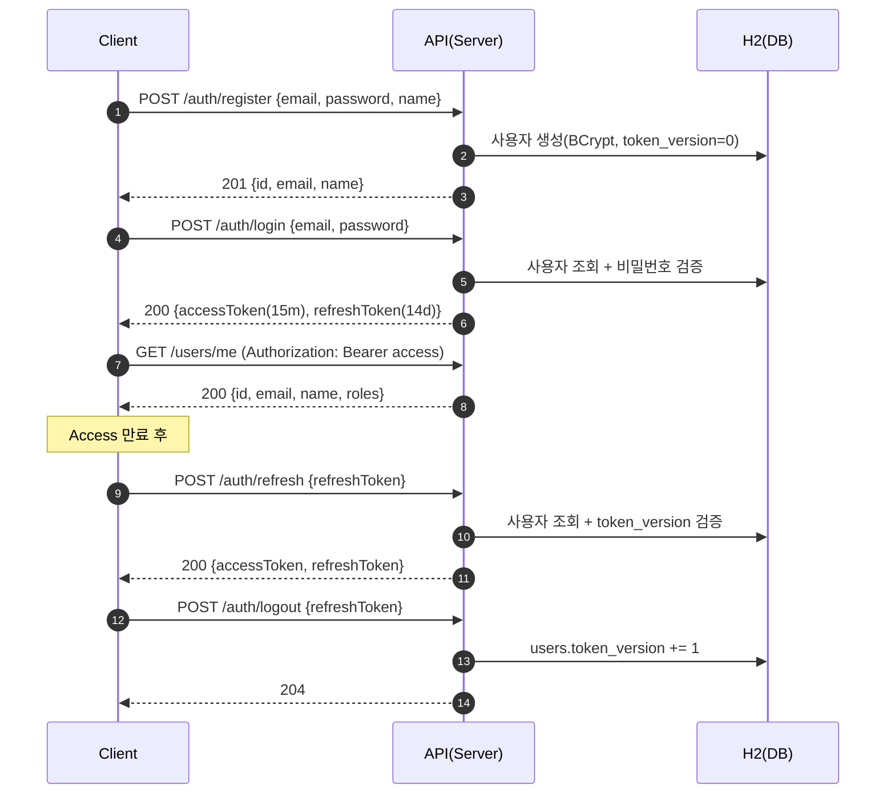
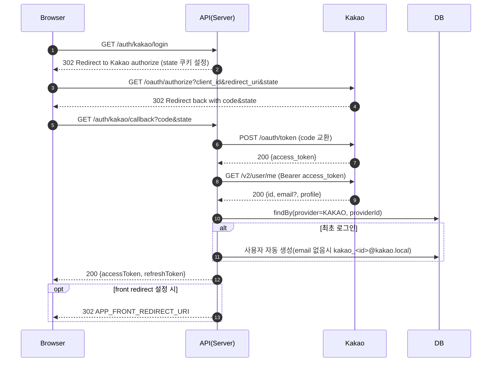

# 로그인/인증 전체 플로우 (KR)

## 개요
- 이메일/비밀번호 회원가입·로그인과 JWT(Access/Refresh) 발급/갱신/로그아웃, 보호 API 인증 흐름을 제공합니다.
- 선택(가산): 카카오 로그인(OAuth2) 연동 — 최초 자동 가입, 재로그인 시 단일 사용자 유지, state 기반 CSRF 대응.

## 구성요소
- 클라이언트: 정적 대시보드 `http://localhost:8080/` 에서 버튼으로 E2E 테스트
- 서버: Spring Boot 3, Spring Security(JWT, Stateless), Validation
- DB: H2(in-memory) — `users`, `items`
- JWT: JJWT(HS256), Access/Refresh 서명·검증

## 환경변수(요약)
- `JWT_ACCESS_SECRET` / `JWT_REFRESH_SECRET`
  - HS256 공유키. 32바이트(256비트) 이상 또는 Base64 디코딩 32바이트 이상 필수
  - 미설정 시 애플리케이션이 바로 종료되므로 반드시 지정해야 함
  - 생성 예: `openssl rand -base64 32`
- `JWT_ACCESS_TTL` / `JWT_REFRESH_TTL`
  - ISO-8601 Duration. 예) `PT15M`(15분), `P14D`(14일)
- `KAKAO_CLIENT_ID` / `KAKAO_CLIENT_SECRET(선택)` / `KAKAO_REDIRECT_URI`
  - 예) `http://localhost:8080/login/oauth2/code/kakao`
- `APP_FRONT_REDIRECT_URI`
  - 카카오 콜백 후 프론트 리다이렉트 URL. 예) `http://localhost:8080/`

> 로컬 개발 편의를 위해 `docker-compose.yml`에 위 변수의 예시 값이 미리 입력되어 있으나, 실 서비스에서는 반드시 안전한 값으로 교체해야 합니다.

## 데이터 모델
- users: `id`, `email(unique)`, `password_hash`, `name`, `role(USER/ADMIN)`, `provider(local/kakao)`, `provider_id`, `token_version`, `created_at`, `updated_at`
- items: `id`, `name`, `created_at`

토큰 버전 전략
- `users.token_version` 증가 시 해당 유저의 기존 Refresh 전부 무효화(로그아웃/비밀번호 변경 등 시 사용).

## 보안/인증 설계
- JWT Claims
  - Access: `sub`(userId), `email`, `role`, `typ=access`, `iat`, `exp`
  - Refresh: `sub`(userId), `email`, `tv`(tokenVersion), `typ=refresh`, `iat`, `exp`
- 만료: Access(기본 15분), Refresh(기본 14일) — 환경변수로 조정
- 서명: HS256(공유키). 키 길이 256비트 이상 필수
- 전달: `Authorization: Bearer <accessToken>`
- 무효화: 로그아웃 시 `token_version += 1`
- Security
  - Stateless, CORS 허용(로컬 프론트 도메인), CSRF 비활성화
  - 정적 리소스(`/index.html` 등), `/auth/**`, `GET /items`는 공개, 그 외 인증 필요

## API 엔드포인트
- Auth
  - `POST /auth/register` — { email, password, name } → 201 { id, email, name }
  - `POST /auth/login` — { email, password } → 200 { accessToken, refreshToken, expiresIn }
  - `POST /auth/refresh` — { refreshToken } → 200 { accessToken, refreshToken, expiresIn }
  - `POST /auth/logout` — { refreshToken } → 204
- User
  - `GET /users/me` — Bearer Access 필요 → 200 { id, email, name, roles }
- Items
  - `GET /items` — 공개
  - `POST /items` — `ROLE_USER` 이상 필요
- Kakao(선택)
  - `GET /auth/kakao/login` — 카카오 인가 페이지로 302
  - `GET /auth/kakao/callback?code=...&state=...` — 내부 JWT 발급(JSON) 또는 프론트로 리다이렉트(`#accessToken=...&refreshToken=...`)

## 사용자 플로우(시나리오)
1) 회원가입
- 입력 검증(이메일 형식/비밀번호 길이), 이메일 중복 시 409
- 비밀번호는 BCrypt 해싱 저장

2) 로그인(ID/PW)
- 자격 검증 실패 시 401(`AUTH_INVALID_CREDENTIALS`)
- 성공 시 Access/Refresh 발급 및 만료(expiresIn) 반환

3) 보호 API 접근
- 헤더 `Authorization: Bearer <accessToken>`로 호출
- 인증 실패/만료 시 401, 권한 부족 시 403

4) 토큰 갱신(Refresh)
- Refresh 유효성·`typ=refresh` 검증, `users.token_version` 일치 확인
- Access/Refresh 재발급(간단 회전 정책)

5) 로그아웃
- Refresh 파싱 → 해당 사용자 `token_version += 1` 저장
- 이후 기존 Refresh로 갱신 시 401(`AUTH_REFRESH_REVOKED`)

6) 카카오 로그인(선택)
- `/auth/kakao/login` → state 쿠키 설정 후 카카오 인가 페이지로 이동(prompt=login 파라미터 포함)
- 콜백에서 코드 교환 → 사용자 조회 → 내부 사용자 연결/최초 자동가입(이메일 미제공 시 `kakao_<id>@kakao.local` 생성)
- 내부 JWT 발급(JSON 또는 `APP_FRONT_REDIRECT_URI`로 리다이렉트)
- 대시보드 버튼은 현재 페이지 경로를 `redirect` 파라미터로 전달하여 로그인 후 동일 화면으로 복귀

## 시퀀스(머메이드)

### 카카오 로그인(가산)

## 실행/테스트 가이드(요약)
- 로컬 실행: `./gradlew bootRun`
- Docker: `docker-compose up --build`
- 대시보드: 브라우저에서 `http://localhost:8080/`
  - 회원가입 → 로그인 → `/users/me` → Items 생성/목록 → 토큰 갱신 → 로그아웃 시나리오 확인
  - Access 만료 빠른 테스트: 실행 전 `JWT_ACCESS_TTL=PT5S` 등으로 조정

## 카카오 설정 체크리스트(KOE006 예방)
- REST API 키 사용(자바스크립트 키 아님)
- Redirect URI 완전 일치(예: `http://localhost:8080/auth/kakao/callback`)
- 플랫폼(Web) 등록 및 Site Domain: `http://localhost:8080`
- 카카오 로그인 활성화
- Client Secret 사용 여부 콘솔/앱 일치
- `localhost` vs `127.0.0.1` 구분하여 등록

## 트러블슈팅
- WeakKeyException: JWT 시크릿이 256비트 미만 → 32바이트 이상(또는 Base64 32바이트 이상)으로 교체
- 401 정적 리소스 접근 불가: 정적 리소스 허용 구성 반영 후 재시작
- 401 AUTH_TOKEN_EXPIRED: Access 만료 → `/auth/refresh`로 재발급
- 401 AUTH_REFRESH_REVOKED: 로그아웃 또는 버전 불일치 → 새 로그인 필요
