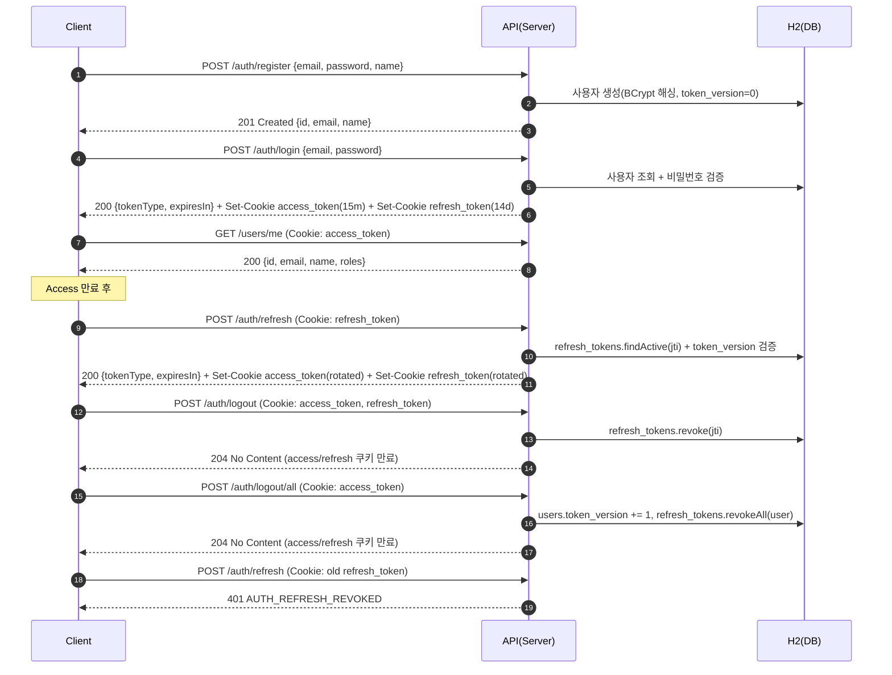
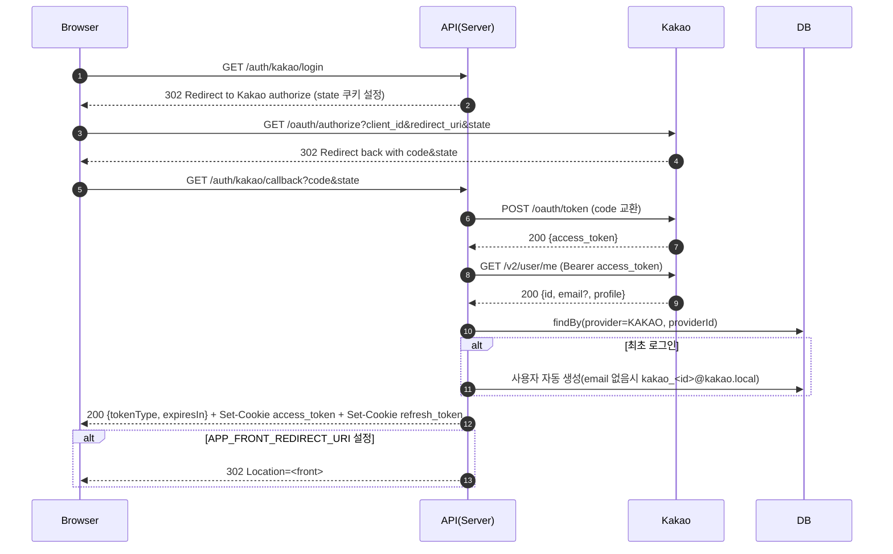

# Login Test (Spring Boot 3, JWT)

Implements email/password signup and login with JWT access/refresh 토큰을 모두 HttpOnly 쿠키로 발급하고, refresh(`userId + jti`)는 서버측에 저장합니다. 기기별 회전, 단일/전체 로그아웃(tokenVersion)과 보호 API `GET /users/me`를 지원합니다.

Optional Kakao OAuth2 is outlined below (skeleton included).

## Stack
- Java 17, Spring Boot 3.5
- Spring Security (stateless, JWT)
- Spring Data JPA + H2 for local dev
- JJWT (HS256)

## Run (local)
```bash
./gradlew bootRun
```

H2 console: `http://localhost:8080/h2-console` (JDBC URL `jdbc:h2:mem:logintest`)

테스트 페이지: `http://localhost:8080/` (정적 HTML 대시보드)

## 사용 방법 (대시보드)
- 실행 후 브라우저에서 `http://localhost:8080/` 접속
- 회원가입: 이메일/비밀번호/이름 입력 → “회원가입” 클릭
- 로그인: “로그인” → Access/Refresh 토큰이 모두 HttpOnly 쿠키로 발급되고 화면에는 토큰이 노출되지 않음
- 내 정보: “/users/me” → 현재 사용자 정보 확인
- 아이템: “목록 새로고침”(공개), “아이템 생성(인증 필요)”(로그인 후)
- 토큰 갱신: “토큰 갱신” → 쿠키에 담긴 refresh_token으로 Access 토큰 재발급
- 로그아웃: “로그아웃” → 현재 기기의 refresh_token만 파기(쿠키 삭제)

빠른 만료 테스트: 실행 전에 `JWT_ACCESS_TTL=PT5S` 등으로 설정하여 갱신/만료 흐름을 쉽게 확인할 수 있습니다.

## Environment Variables
애플리케이션은 부팅 시 `JWT_ACCESS_SECRET` / `JWT_REFRESH_SECRET`이 없으면 즉시 종료합니다. 셸에서 직접 export 하거나 `docker-compose.yml`을 수정해 안전한 값을 넣어주세요. HS256을 사용하므로 비밀키는 최소 256비트(32바이트 이상)여야 합니다.

```
JWT_ACCESS_SECRET=dev-access-secret-please-change-32bytes-min-123456
JWT_REFRESH_SECRET=dev-refresh-secret-please-change-32bytes-min-abcdef
# ISO-8601 durations: PT15M=15 minutes, P14D=14 days
JWT_ACCESS_TTL=PT15M
JWT_REFRESH_TTL=P14D
JWT_COOKIE_SECURE=false
JWT_COOKIE_SAMESITE=Lax
```

값을 지정하지 않으면 애플리케이션이 시작되지 않습니다. 아래 예시는 개발 편의용이니 실제 환경에서는 반드시 교체하세요. `JWT_COOKIE_SECURE`는 로컬 개발에서 `false`(HTTP 허용), 운영 환경에서는 반드시 `true`(HTTPS 전용)로 설정하세요. SameSite는 기본 `Lax`이며, 별도 프런트 도메인에서 쿠키를 공유해야 하면 `None`으로 override 후 HTTPS를 사용해야 합니다.

강력한 비밀키(32바이트를 Base64 인코딩)를 생성하려면 다음 명령을 사용할 수 있습니다:

```bash
openssl rand -base64 32
# 또는
head -c 32 /dev/urandom | base64
```
비밀키는 32바이트 이상인 원시 문자열(raw string) 또는 32바이트 이상으로 디코딩되는 Base64 문자열(Base64 string) 모두 사용할 수 있습니다. 애플리케이션은 먼저 Base64 디코딩을 시도하고, 실패하면 원시 바이트를 그대로 사용합니다.

## Docker

### Build & Run (Docker)
```bash
docker build -t logintest:local .
docker run --rm -p 8080:8080 \
  -e JWT_ACCESS_SECRET=dev-access-secret-please-change-32bytes-min-123456 \
  -e JWT_REFRESH_SECRET=dev-refresh-secret-please-change-32bytes-min-abcdef \
  -e JWT_ACCESS_TTL=PT15M -e JWT_REFRESH_TTL=P14D \
  -e KAKAO_CLIENT_ID=your_kakao_client_id \
  -e KAKAO_REDIRECT_URI=http://localhost:8080/login/oauth2/code/kakao \
  logintest:local
```

### Docker Compose
```bash
docker-compose up --build
```
Swagger UI: `http://localhost:8080/swagger-ui/index.html` (springdoc-openapi)

`docker-compose.yml`에는 개발용 값이 하드코딩되어 있어 바로 실행할 수 있습니다. 보안 환경에서는 해당 파일의 `environment` 블록을 안전한 값으로 교체하거나 `docker-compose --env-file` 옵션 등을 사용하세요.

> 카카오 로그인 테스트를 하려면 `docker-compose.yml`의 `KAKAO_CLIENT_ID` / `KAKAO_CLIENT_SECRET`을 발급받은 값으로 바꿔주세요. 테스트에 노출된 키를 사용했다면 **반드시 콘솔에서 재발급 후** 새 값을 설정해야 합니다. HTTPS 환경에서는 `JWT_COOKIE_SECURE=true`, 크로스 도메인 프런트가 있다면 `JWT_COOKIE_SAMESITE=None`을 함께 지정하세요.

## API

## 사용 방법 (API 직접 호출)
- 회원가입
```bash
curl -X POST http://localhost:8080/auth/register \
  -H 'Content-Type: application/json' \
  -d '{"email":"a@b.com","password":"P@ssw0rd!","name":"Alice"}'
```
- 로그인 (Set-Cookie 수신을 위해 쿠키 저장)
```bash
curl -i -c cookie.txt -X POST http://localhost:8080/auth/login \
  -H 'Content-Type: application/json' \
  -d '{"email":"a@b.com","password":"P@ssw0rd!"}'
```
- 내 정보
```bash
curl -b cookie.txt http://localhost:8080/users/me
```
- 토큰 갱신
```bash
curl -X POST http://localhost:8080/auth/refresh \
  -b cookie.txt
```
- 로그아웃
```bash
curl -X POST http://localhost:8080/auth/logout \
  -b cookie.txt
```
- 전체 로그아웃(tokenVersion 증가)
```bash
curl -X POST http://localhost:8080/auth/logout/all \
  -b cookie.txt
```

### POST `/auth/register`
Request:
```
{ "email": "a@b.com", "password": "P@ssw0rd!", "name": "Alice" }
```
Response 201:
```
{ "id": 1, "email": "a@b.com", "name": "Alice" }
```

### POST `/auth/login`
Request:
```
{ "email": "a@b.com", "password": "P@ssw0rd!" }
```
Response 200:
```
Set-Cookie: refresh_token=...; HttpOnly; Secure; SameSite=Lax

Body:
{ "tokenType": "Bearer", "expiresIn": 900 }
```

### POST `/auth/refresh`
쿠키(`refresh_token`) 필수, 본문 없음.
Response 200:
```
Set-Cookie: refresh_token=...; HttpOnly; Secure; SameSite=Lax

Body:
{ "tokenType": "Bearer", "expiresIn": 900 }
```

### POST `/auth/logout`
쿠키(`refresh_token`) 필수, 본문 없음.
Response 204 (access_token/refresh_token 쿠키 즉시 만료)

### POST `/auth/logout/all`
쿠키(`access_token`, `refresh_token`) 필요, 본문 없음.

Response 204 (access/refresh 쿠키 만료 + tokenVersion++)

### GET `/users/me`
쿠키(`access_token`) 필요.
Response 200:
```
{ "id": 1, "email": "a@b.com", "name": "Alice", "roles": ["USER"] }
```

### Public/Secured Items
- GET `/items` — 공개 API, 아이템 목록
- POST `/items` — 본문 `{ "name": "ItemA" }`, ROLE_USER 이상 필요 → 201

## Auth Design
- JWT Claims:
  - Access: `sub`(userId), `email`, `role`, `typ=access`, `iat`, `exp`
-  - Refresh: `sub`(userId), `email`, `tv`(tokenVersion), `jti`, `typ=refresh`, `iat`, `exp`
- Expiry: configurable via `JWT_ACCESS_TTL` and `JWT_REFRESH_TTL` (default 15m/14d). 기본값은 보안과 UX 사이 타협: Access 토큰은 15분 만료(탈취 시 영향 최소화), Refresh 토큰은 14일(주기적인 로그인 방지)로 설정하고 필요 시 환경변수로 조정합니다.
- Signing: **HS256** (공유 키)
  - 이유: 단일 서비스 구조에서 키 관리가 단순하고, 환경변수 기반으로 빠르게 교체할 수 있어 과제 범위 내 개발/테스트가 용이합니다.
  - RS256 미선택 사유: 비대칭 키를 쓰려면 KMS/비밀 저장소에 개인키를 두고, 검증 노드에 공개키를 배포하며, 키 회전·JWKS 공개까지 포함한 운영 전략이 필요합니다. 이번 과제에서는 해당 인프라 구성이 범위를 벗어나 단일 키(HS256)를 택했습니다.
  - 향후 확장: `JwtTokenService` 시그니처를 바꿔 키 로딩 방식을 추상화하면 RS256 전환이 가능하며, 다중 서비스에서 토큰 검증을 공유하려면 공개키 노출(JWKS) 등을 추가하면 됩니다.
- Delivery:
  - Access 토큰: `access_token` HttpOnly + Secure + SameSite=Lax 쿠키 (필요 시 Bearer 헤더도 지원)
  - Refresh 토큰: `refresh_token` HttpOnly + Secure + SameSite=Lax 쿠키
  - Secure/SameSite 정책은 `JWT_COOKIE_SECURE` / `JWT_COOKIE_SAMESITE` 환경변수로 조정 (로컬 테스트는 `false`, 운영은 `true` 권장)
- Server-side storage: `refresh_tokens` 테이블에 `user_id`, `jti`, `expires_at`, `revoked`를 보관하여 재사용/무효화 추적
- Invalidation:
  - 단일 로그아웃: 해당 `jti` 레코드만 `revoked` 처리 + 쿠키 삭제
  - 전체 로그아웃: `users.token_version` 증가 + `refresh_tokens` 레코드 일괄 `revoked`

## Error Format
```
{ "timestamp": "...", "path": "/auth/login", "status": 401, "code": "AUTH_INVALID_CREDENTIALS", "message": "Invalid email or password" }
```

보안 에러 처리
- 인증 실패(미인증/만료): 401 + JSON(`AUTH_INVALID_CREDENTIALS` 또는 `AUTH_TOKEN_EXPIRED`)
- 토큰 유형 오류/위조: 401 + JSON(`AUTH_TOKEN_INVALID`)
- Refresh 쿠키 미제공/만료/재사용: 401 + JSON(`AUTH_REFRESH_REQUIRED`, `AUTH_REFRESH_REVOKED`)
- 권한 부족: 403 + JSON(`AUTH_FORBIDDEN`)

## Notes / Decisions
- Refresh 토큰은 DB(`refresh_tokens`)에 저장하여 재사용/무효화 이력을 추적합니다. 단일 로그아웃은 jti 레코드만 폐기하고, 전체 로그아웃은 tokenVersion 증가 + 레코드 일괄 `revoked` 처리합니다.
- Access 토큰 파싱은 `JwtAuthFilter`에서 수행하고 `typ=access`만 통과시켜 보호 API가 Refresh 토큰을 허용하지 않도록 강제합니다.
- Passwords are hashed with BCrypt.

## Kakao OAuth2 (Plus)
구현됨:
- GET `/auth/kakao/login` → 카카오 인증 URL로 302 리다이렉트 (state 쿠키로 CSRF 대응)
- GET `/auth/kakao/callback?code=...&state=...` → 코드 교환 → 카카오 사용자 조회 → 내부 사용자 연결/자동가입 → Access/Refresh 쿠키 발급 + 메타 정보(JSON)
- 선택: `APP_FRONT_REDIRECT_URI`를 설정하면 콜백에서 해당 URL로 `#login=success` 형태로 리다이렉트하며 access/refresh 쿠키를 함께 발급

매핑/정책:
- 기본 연결 키: `provider=KAKAO`, `provider_id=<kakao id>`
- 이메일 미제공 시 `kakao_<id>@kakao.local` 생성(중복 방지용)
- 최초 로그인 시 자동 가입(ROLE=USER, passwordHash=null)
- 재로그인 시 동일 providerId로 기존 계정 재사용 → 중복 생성 방지

환경변수(업데이트됨):
```
KAKAO_CLIENT_ID=...            # 필수
KAKAO_CLIENT_SECRET=...        # 콘솔에서 "사용함"이면 필수(일치해야 함)
KAKAO_REDIRECT_URI=http://localhost:8080/login/oauth2/code/kakao   # 기본값도 동일
APP_FRONT_REDIRECT_URI=http://localhost:8080/                      # 선택(미설정 시 기본적으로 / 로 이동)
```

카카오 로그인 흐름(업데이트됨)
```
1) 기본 동작: 카카오 콜백에서 홈(/)으로 302 리다이렉트
   - 응답 헤더: Set-Cookie access_token=..., refresh_token=...
   - URL 해시: #login=success
   index.html은 성공 메시지를 표시하고 쿠키 기반으로 `/users/me` 호출

2) 프런트 리다이렉트: APP_FRONT_REDIRECT_URI 설정 시 해당 URL로 302 (#login=success)

3) redirect 파라미터: /auth/kakao/login?redirect=/next → /next#login=success
   (동일 오리진 경로만 허용, access/refresh 쿠키는 항상 함께 발급)
```

## Mermaid Flow

### ID/PW 로그인 + 토큰 갱신/로그아웃


### 카카오 로그인(가산)


## Testing
Add a couple of integration tests (e.g., register/login/me, refresh after access expiry, logout invalidates refresh) if time allows. Running tests will download dependencies.
