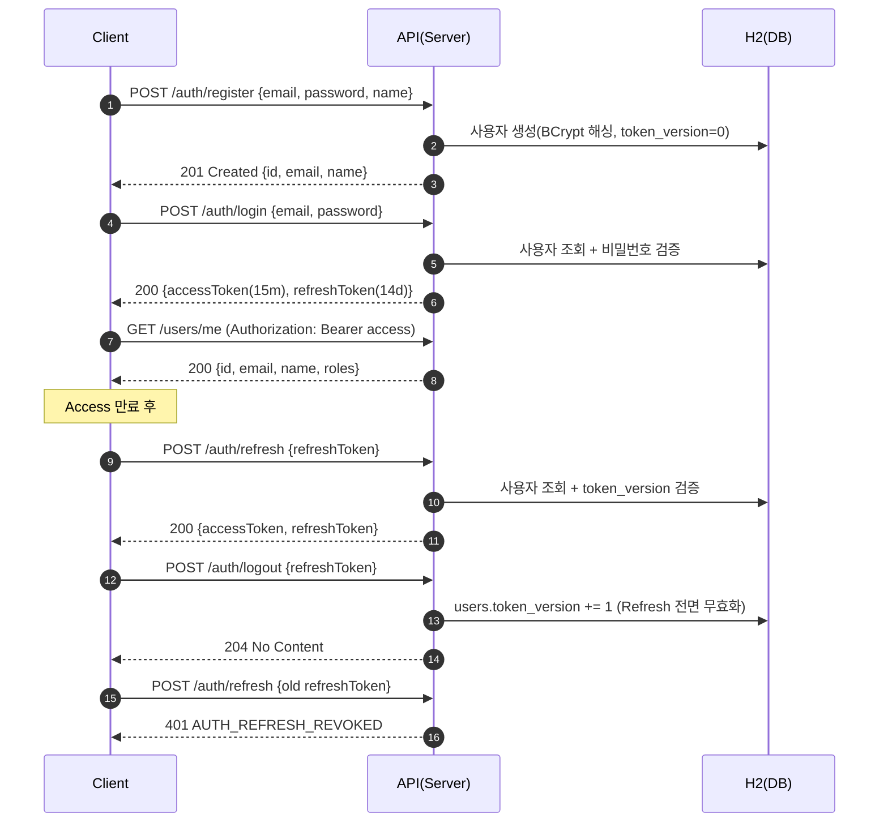
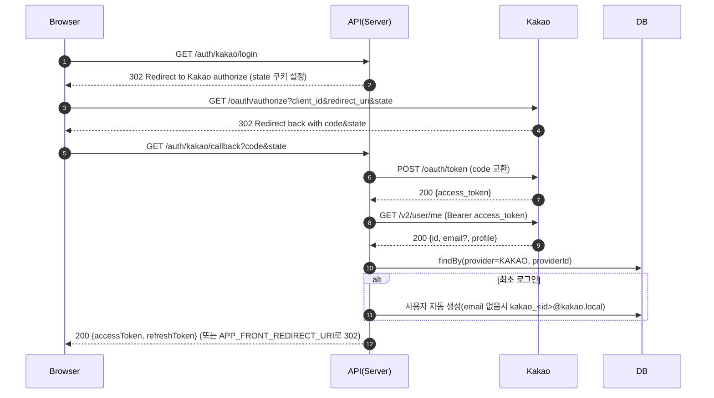

# Login Test (Spring Boot 3, JWT)

Implements email/password signup and login with JWT Access/Refresh tokens, refresh rotation (token-version strategy), logout (invalidate refresh by bumping version), and a protected API `GET /users/me`.

Optional Kakao OAuth2 is outlined below (skeleton not included by default).

## Stack
- Java 17, Spring Boot 3.5
- Spring Security (stateless, JWT)
- Spring Data JPA + H2 for local dev
- JJWT (HS256)

## Run (local)
```bash
./gradlew bootRun
```

H2 console: `http://localhost:8080/h2-console` (JDBC URL `jdbc:h2:mem:logintest`)

테스트 페이지: `http://localhost:8080/` (정적 HTML 대시보드)

## 사용 방법 (대시보드)
- 실행 후 브라우저에서 `http://localhost:8080/` 접속
- 회원가입: 이메일/비밀번호/이름 입력 → “회원가입” 클릭
- 로그인: “로그인” → Access/Refresh 토큰이 화면에 표시/저장(localStorage)
- 내 정보: “/users/me” → 현재 사용자 정보 확인
- 아이템: “목록 새로고침”(공개), “아이템 생성(인증 필요)”(로그인 후)
- 토큰 갱신: “토큰 갱신” → 새 Access/Refresh 발급
- 로그아웃: “로그아웃” → 서버 측 Refresh 무효화(token_version 증가)

빠른 만료 테스트: 실행 전에 `JWT_ACCESS_TTL=PT5S` 등으로 설정하여 갱신/만료 흐름을 쉽게 확인할 수 있습니다.

## Environment Variables
애플리케이션은 부팅 시 `JWT_ACCESS_SECRET` / `JWT_REFRESH_SECRET`이 없으면 즉시 종료합니다. 셸에서 직접 export 하거나 `docker-compose.yml`을 수정해 안전한 값을 넣어주세요. HS256을 사용하므로 비밀키는 최소 256비트(32바이트 이상)여야 합니다.

```
JWT_ACCESS_SECRET=dev-access-secret-please-change-32bytes-min-123456
JWT_REFRESH_SECRET=dev-refresh-secret-please-change-32bytes-min-abcdef
# ISO-8601 durations: PT15M=15 minutes, P14D=14 days
JWT_ACCESS_TTL=PT15M
JWT_REFRESH_TTL=P14D
```

값을 지정하지 않으면 애플리케이션이 시작되지 않습니다. 아래 예시는 개발 편의용이니 실제 환경에서는 반드시 교체하세요.

강력한 비밀키(32바이트를 Base64 인코딩)를 생성하려면 다음 명령을 사용할 수 있습니다:

```bash
openssl rand -base64 32
# 또는
head -c 32 /dev/urandom | base64
```
비밀키는 32바이트 이상인 원시 문자열(raw string) 또는 32바이트 이상으로 디코딩되는 Base64 문자열(Base64 string) 모두 사용할 수 있습니다. 애플리케이션은 먼저 Base64 디코딩을 시도하고, 실패하면 원시 바이트를 그대로 사용합니다.

## Docker

### Build & Run (Docker)
```bash
docker build -t logintest:local .
docker run --rm -p 8080:8080 \
  -e JWT_ACCESS_SECRET=dev-access-secret-please-change-32bytes-min-123456 \
  -e JWT_REFRESH_SECRET=dev-refresh-secret-please-change-32bytes-min-abcdef \
  -e JWT_ACCESS_TTL=PT15M -e JWT_REFRESH_TTL=P14D \
  -e KAKAO_CLIENT_ID=your_kakao_client_id \
  -e KAKAO_REDIRECT_URI=http://localhost:8080/login/oauth2/code/kakao \
  logintest:local
```

### Docker Compose
```bash
docker-compose up --build
```
Swagger UI: `http://localhost:8080/swagger-ui/index.html` (springdoc-openapi)

`docker-compose.yml`에는 개발용 값이 하드코딩되어 있어 바로 실행할 수 있습니다. 보안 환경에서는 해당 파일의 `environment` 블록을 안전한 값으로 교체하거나 `docker-compose --env-file` 옵션 등을 사용하세요.

## API

## 사용 방법 (API 직접 호출)
- 회원가입
```bash
curl -X POST http://localhost:8080/auth/register \
  -H 'Content-Type: application/json' \
  -d '{"email":"a@b.com","password":"P@ssw0rd!","name":"Alice"}'
```
- 로그인
```bash
curl -s -X POST http://localhost:8080/auth/login \
  -H 'Content-Type: application/json' \
  -d '{"email":"a@b.com","password":"P@ssw0rd!"}'
```
- 내 정보
```bash
curl http://localhost:8080/users/me -H "Authorization: Bearer <accessToken>"
```
- 토큰 갱신
```bash
curl -X POST http://localhost:8080/auth/refresh \
  -H 'Content-Type: application/json' \
  -d '{"refreshToken":"<refreshToken>"}'
```
- 로그아웃
```bash
curl -X POST http://localhost:8080/auth/logout \
  -H 'Content-Type: application/json' \
  -d '{"refreshToken":"<refreshToken>"}'
```

### POST `/auth/register`
Request:
```
{ "email": "a@b.com", "password": "P@ssw0rd!", "name": "Alice" }
```
Response 201:
```
{ "id": 1, "email": "a@b.com", "name": "Alice" }
```

### POST `/auth/login`
Request:
```
{ "email": "a@b.com", "password": "P@ssw0rd!" }
```
Response 200:
```
{ "accessToken": "...", "refreshToken": "...", "expiresIn": 900 }
```

### POST `/auth/refresh`
Request:
```
{ "refreshToken": "..." }
```
Response 200:
```
{ "accessToken": "...", "refreshToken": "...", "expiresIn": 900 }
```

### POST `/auth/logout`
Request:
```
{ "refreshToken": "..." }
```
Response 204

### GET `/users/me`
Headers: `Authorization: Bearer <accessToken>`
Response 200:
```
{ "id": 1, "email": "a@b.com", "name": "Alice", "roles": ["USER"] }
```

### Public/Secured Items
- GET `/items` — 공개 API, 아이템 목록
- POST `/items` — 본문 `{ "name": "ItemA" }`, ROLE_USER 이상 필요 → 201

## Auth Design
- JWT Claims:
  - Access: `sub`(userId), `email`, `role`, `typ=access`, `iat`, `exp`
  - Refresh: `sub`(userId), `email`, `tv`(tokenVersion), `typ=refresh`, `iat`, `exp`
- Expiry: configurable via `JWT_ACCESS_TTL` and `JWT_REFRESH_TTL` (default 15m/14d)
- Signing: HS256 with secrets from env
- Delivery: `Authorization: Bearer <token>` header
- Invalidation: On logout, increment `users.token_version` so old refresh tokens are rejected

## Error Format
```
{ "timestamp": "...", "path": "/auth/login", "status": 401, "code": "AUTH_INVALID_CREDENTIALS", "message": "Invalid email or password" }
```

보안 에러 처리
- 인증 실패(미인증/만료): 401 + JSON(`AUTH_INVALID_CREDENTIALS` 또는 `AUTH_TOKEN_EXPIRED`)
- 권한 부족: 403 + JSON(`AUTH_FORBIDDEN`)

## Notes / Decisions
- Refresh-token storage is NOT used; we apply token-version invalidation (simple and robust).
- Access token parsing happens in `JwtAuthFilter` and populates Spring Security context.
- Passwords are hashed with BCrypt.

## Kakao OAuth2 (Plus)
구현됨:
- GET `/auth/kakao/login` → 카카오 인증 URL로 302 리다이렉트 (state 쿠키로 CSRF 대응)
- GET `/auth/kakao/callback?code=...&state=...` → 코드 교환 → 카카오 사용자 조회 → 내부 사용자 연결/자동가입 → 내부 JWT 발급(JSON)
- 선택: `APP_FRONT_REDIRECT_URI`를 설정하면 콜백에서 해당 URL로 `#accessToken=...&refreshToken=...` 형태로 리다이렉트

매핑/정책:
- 기본 연결 키: `provider=KAKAO`, `provider_id=<kakao id>`
- 이메일 미제공 시 `kakao_<id>@kakao.local` 생성(중복 방지용)
- 최초 로그인 시 자동 가입(ROLE=USER, passwordHash=null)
- 재로그인 시 동일 providerId로 기존 계정 재사용 → 중복 생성 방지

환경변수(업데이트됨):
```
KAKAO_CLIENT_ID=...            # 필수
KAKAO_CLIENT_SECRET=...        # 콘솔에서 "사용함"이면 필수(일치해야 함)
KAKAO_REDIRECT_URI=http://localhost:8080/login/oauth2/code/kakao   # 기본값도 동일
APP_FRONT_REDIRECT_URI=http://localhost:8080/                      # 선택(미설정 시 기본적으로 / 로 이동)
```

카카오 로그인 흐름(업데이트됨)
```
1) 기본 동작: 카카오 콜백에서 홈(/)으로 302 리다이렉트하며 URL 해시에 토큰 전달
   예) http://localhost:8080/#accessToken=...&refreshToken=...
   화면(index.html)이 해시를 파싱해 토큰을 저장하고 로그인 상태를 표시

2) 프런트로 리다이렉트: APP_FRONT_REDIRECT_URI를 설정하면 해당 URL로 리다이렉트(#토큰 포함)
   예) APP_FRONT_REDIRECT_URI=http://localhost:3000/auth/callback

3) 특정 경로로 리다이렉트: /auth/kakao/login?redirect=/next 형태로 시작하면
   콜백 후 /next#accessToken=...&refreshToken=... 로 이동(동일 오리진 경로만 허용)
```
이 경우 콜백에서 `http://localhost:8080/#accessToken=...&refreshToken=...` 로 리다이렉트되고, 페이지가 해시를 파싱해 토큰을 저장합니다.

## Mermaid Flow

### ID/PW 로그인 + 토큰 갱신/로그아웃


### 카카오 로그인(가산)


## Testing
Add a couple of integration tests (e.g., register/login/me, refresh after access expiry, logout invalidates refresh) if time allows. Running tests will download dependencies.
